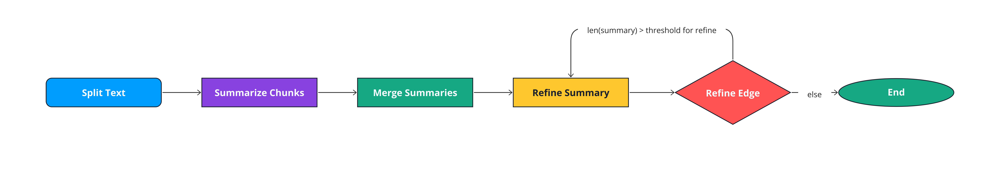
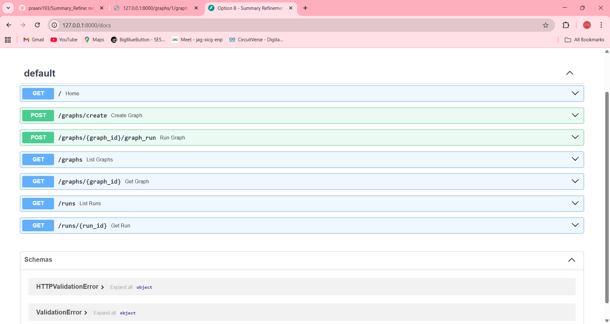

# Summary Refinement Workflow Engine

## How to Run
1. Activate the virtual environment:  
   ```bash
   # Windows
   venv\Scripts\activate

   # macOS/Linux
   source venv/bin/activate

2. Install dependencies:

   ```bash
   pip install --upgrade pip setuptools wheel
   pip install -r requirements.txt
   ```
   
3. Start the FastAPI server:

   ```bash
   uvicorn app.main:app --reload
   ```
4. Access API at: `http://127.0.0.1:8000`

5. Interactive API docs: `http://127.0.0.1:8000/docs`

---

## Workflow Engine Supports

* Create and manage **summary graphs**
* Run graphs to **split, summarize, merge, and refine text**
* Persistently store **graph and run results** in JSON files
* List and retrieve **graphs and run histories**

### Workflow Diagram

---
## Project Structure

| Path | Type | Description |
|------|------|-------------|
| `app/main.py` | File | FastAPI entry point, defines API endpoints |
| `app/engine/graph.py` | File | Graph and Runner classes to define/execute workflows |
| `app/engine/test.py` | File | Test scripts for graph engine |
| `app/nodes/` | Folder | Functions for split, summarize, merge, and refine |
| `app/memory/memory.py` | File | Load/save graphs and run data |
| `app/memory/graphs.json` | File | Stores graph definitions |
| `app/memory/runs.json` | File | Stores run results |
| `venv/` | Folder | Virtual environment with dependencies |
| `requirements.txt` | File | Project dependencies |
| `LICENSE` | File | License information |
| `README.md` | File | Project overview and instructions |
| `External Libraries/` | Folder | Optional third-party libraries |
| `Scratches and Consoles/` | Folder | Experimental/test scripts |

---

## FastAPI Endpoints
| Endpoint                       | Method | Description                                                                                                         |
| ------------------------------ | ------ | ------------------------------------------------------------------------------------------------------------------- |
| `/`                            | GET    | Returns a welcome message for the Summary Refinement Workflow Engine.                                               |
| `/graphs/create`               | POST   | Creates a new summary graph and returns its `graph_id`.                                                             |
| `/graphs/{graph_id}/graph_run` | POST   | Runs the specified graph with the provided `payload`. Returns the `run_id`, `graph_id`, `run_number`, and `result`. |
| `/graphs`                      | GET    | Lists all existing graphs with their metadata.                                                                      |
| `/graphs/{graph_id}`           | GET    | Retrieves details of a specific graph by `graph_id`. Returns error if not found.                                    |
| `/runs`                        | GET    | Lists all run histories with results.                                                                               |
| `/runs/{run_id}`               | GET    | Retrieves details of a specific run by `run_id`. Returns error if not found.                                        |

### SwaggerUI result



## Improvements with More Time

* Add **Pydantic models** for structured payload validation
* Implement **unit tests** for nodes and graph execution
* Enhance **text refinement algorithms** with advanced NLP models
* Add **authentication and access control** for API endpoints
